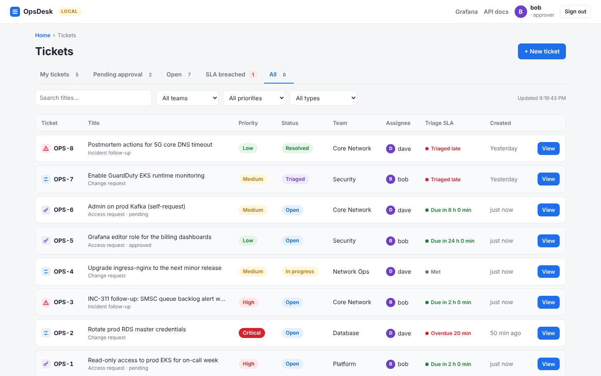
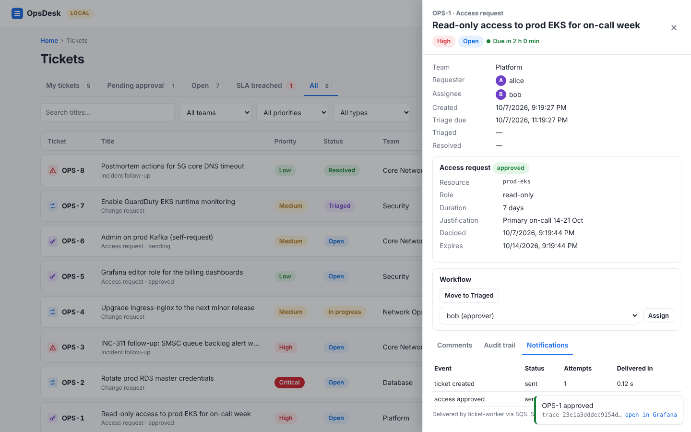
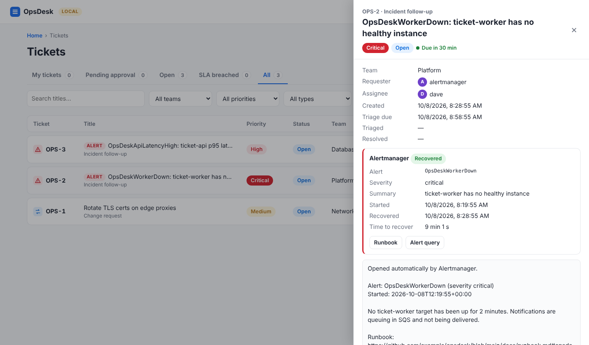

# OpsDesk — Internal DevOps Ticketing & Access Request Portal

Week 4 project · Observability / SRE specialization.

**The problem:** a telecom operator cannot quickly tell whether an outage comes from Kubernetes, application code,
queues, databases or networking. **This project** is an observability platform on EKS that answers that question in
minutes — metrics, logs, traces across the queue, layer-aware alerts and incident response — demonstrated on a real
workload and proven with failure drills, one per layer.

The workload is **OpsDesk**, the operations team's internal ticketing and access-request portal: **ticket-api**
(FastAPI, also serves the web UI) and **ticket-worker** (SQS consumer) on PostgreSQL. Every call to a dependency is
classified when it fails (`dns`, `connect_timeout`, `too_many_connections`, `pool_timeout`, …), so the platform can
say *which layer* broke. Alerts open incident tickets in OpsDesk itself, naming the suspected layer.

| Layer | How the platform tells | Alert (opens a ticket) | Drill |
| --- | --- | --- | --- |
| Kubernetes | pod availability, restarts, worker presence (kube-state-metrics) | `OpsDeskWorkerDown`, `OpsDeskPodsUnavailable` | 1 pod kill (self-heals), 3 worker stopped |
| Application | 5xx and latency while database time and dependency errors stay normal; traces | `OpsDeskErrorBudgetBurn` (SLO burn rate), `OpsDeskApiLatencyHigh`, `OpsDeskDbPoolExhausted` | `errors-on`, 2 latency |
| Queue | SQS depth and DLQ depth sampled by the API, worker poll age, delivery time | `OpsDeskQueueBacklog`, `OpsDeskDlqNotEmpty` | 3 poison message |
| Database | time inside PostgreSQL per statement, database-side errors | `OpsDeskDatabaseSlow`, `OpsDeskDatabaseErrors` | 2 missing index, 4 connection limit |
| Network | failed connections by kind (`connect_timeout`, `dns`, `refused`), CoreDNS | `OpsDeskDependencyUnreachable` | 6 NetworkPolicy blocks the database |

Triage starts on the Grafana dashboard **OpsDesk - Where is the fault?**: five verdict tiles (one per layer) and one
row per layer on the same time axis. On-call steps per alert: [docs/runbook.md](docs/runbook.md). Costs and savings:
[docs/cost.md](docs/cost.md).



```
browser UI / client ──HTTP──▶ ticket-api ──SQL──▶ PostgreSQL (RDS)
                    │  traceparent in MessageAttributes
                    ▼
                SQS queue ──(3 failed receives)──▶ DLQ
                    │
                    ▼
              ticket-worker ──▶ Slack webhook (or log-only)

metrics ─▶ Prometheus ─▶ Grafana ◀─ Tempo ◀─ OTLP traces      JSON logs (trace_id) ─▶ CloudWatch on EKS
              │ alert rules
              ▼
         Alertmanager ──POST /integrations/alertmanager (bearer token)──▶ ticket-api: incident ticket (+ time to recover)
```

| Stage | Status | Contents |
| --- | --- | --- |
| 1. App + Docker Desktop Kubernetes | **done** | app + web UI, tests, Dockerfile, Helm chart, local deps, Prometheus/Grafana/Tempo, starter dashboard, k6 load |
| 2. AWS (EKS) | **code ready** — see [docs/aws.md](docs/aws.md) | Terraform `infra` / `platform`, CloudFormation OIDC bootstrap, EKS Helm values + ExternalSecret, architecture diagram, [security findings report](docs/security/findings.md) |
| 3a. CI/CD | **code ready** | GitHub Actions: CI gates (tests, Trivy, Checkov, kubeconform), Infrastructure (plan/apply), Release (build → scan → approve → deploy → smoke → rollback), Ops (drills, load), Destroy |
| 3b. SRE config | **code ready** | SLO recording rules + multi-window burn-rate alert, layer-aware cause alerts (symptoms muted while a cause fires), Alertmanager → OpsDesk incident tickets, fault-domain dashboard, [runbook](docs/runbook.md), drill 6 (network), [cost analysis](docs/cost.md) |
| 4. Evidence | **next (on AWS)** | run Infrastructure + Release, drills 1–6, screenshots, Cost Explorer numbers, presentation |

**On AWS:** nothing runs locally. GitHub Actions (OIDC, no AWS keys) applies Terraform, builds, scans and deploys;
one CloudFormation stack created in the AWS console bootstraps the trust. Setup, workflows, drills, costs and
teardown: **[docs/aws.md](docs/aws.md)**.

---

## Run it on Docker Desktop Kubernetes

### Prerequisites

- Docker Desktop with **Kubernetes enabled** (Settings → Kubernetes → Enable; the default *kubeadm* cluster
  shares Docker's image store, so locally built images need no registry)
- `kubectl` and `helm` 3 on your PATH (`winget install Helm.Helm` if helm is missing)
- About 6 GB of memory for Docker Desktop if you install the observability stack

### Start everything

From the repo root in PowerShell:

```powershell
# If scripts are blocked: Set-ExecutionPolicy -Scope Process Bypass
./scripts/local-up.ps1 -Observability -Load
```

That script:

1. builds `opsdesk:local-<timestamp>` (a new immutable tag every run, like commit-SHA tags in CI)
2. deploys Postgres and ElasticMQ (SQS-compatible) into namespace `opsdesk-deps`
3. installs kube-prometheus-stack + Tempo into `observability` (`-Observability`)
4. deploys the chart into `opsdesk` (Pod Security `restricted` enforced) with `helm upgrade --atomic`
5. starts k6 at 5 requests/second (`-Load`)
6. runs `scripts/smoke.ps1` — the same post-deploy checks CI will run

Without `-Observability` the app still runs; traces just aren't exported.

| What | Where |
| --- | --- |
| **Web UI** | http://localhost:8080/ — pick a demo user on the sign-in page |
| Swagger UI | http://localhost:8080/docs |
| Grafana | http://localhost:3000 — `admin` / `opsdesk-local` → dashboards **OpsDesk - Where is the fault?** and **OpsDesk - Service overview** |
| Prometheus | `kubectl -n observability port-forward svc/kube-prometheus-stack-prometheus 9090` |
| Logs | `kubectl -n opsdesk logs deploy/opsdesk-api -f` (JSON, each line has `trace_id`) |
| Alertmanager | `kubectl -n observability port-forward svc/kube-prometheus-stack-alertmanager 9093` |

Tear down: `./scripts/local-down.ps1` (add `-All` to remove the observability stack too).

### Local API keys

Send the key in the `X-API-Key` header (in Swagger: use the header field on each call).

| User | Role | Key |
| --- | --- | --- |
| alice | requester | `alice-local-key` |
| bob | approver | `bob-local-key` |
| dave | approver | `dave-local-key` |
| carol | admin | `carol-local-key` |

```powershell
$h = @{ "X-API-Key" = "alice-local-key" }
$body = '{"type":"access_request","title":"Read-only on prod EKS","access":{"resource":"prod-eks","requested_role":"read-only","justification":"on-call week"}}'
Invoke-RestMethod -Method Post http://localhost:8080/tickets -Headers $h -ContentType application/json -Body $body
```

---

## Web UI

Served by ticket-api at `/ui` (plain HTML/CSS/JS, no separate build or container, so the image scan,
pipeline and dashboards already cover it).

- **Tabs:** My tickets · Pending approval · Open · SLA breached · All, with live counts; filters by team, priority, type and title search
- **Table:** `OPS-<n>` id with type icon, title, priority, status, team, assignee, **triage SLA** (on track / due soon / overdue / met), age
- **Ticket drawer:** access-request card with Approve/Reject, workflow buttons for the allowed next statuses, assign / assign to me,
  comments, the append-only **audit trail** (each entry links to its trace) and **notification delivery times** from the worker
- **Tracing from the browser:** every call sends a W3C `traceparent`, so a click and the server spans (API → DB → SQS → worker)
  share one trace id. Toasts and audit entries link straight to Grafana Explore when `OPSDESK_GRAFANA_URL` is set.
- **Security:** strict Content-Security-Policy (no inline script, no third-party origins), `X-Frame-Options: DENY`,
  API key kept in `sessionStorage`; demo logins appear only when `OPSDESK_ENVIRONMENT=local`
- **Alert tickets:** tickets opened by Alertmanager carry an **ALERT** badge; the drawer shows the alert card
  (firing / recovered, started, time to recover, runbook and alert-query links)
- Light and dark mode follow the OS setting



Triage SLA targets (wall clock): critical 30 min · high 2 h · medium 8 h · low 24 h. Teams: Platform, Network Ops,
Security, Database, Core Network.

## Alerts → incident tickets

The team that runs OpsDesk uses OpsDesk for its own incidents. Alert rules ship with the chart
(`helm/opsdesk/templates/prometheusrule.yaml`, layer table above), each with `severity` (ticket priority),
`team` (ticket team), `layer` (shown on the ticket as *Suspected layer*) and a `runbook_url` into
[docs/runbook.md](docs/runbook.md).

- **Symptoms vs causes.** `OpsDeskErrorBudgetBurn` (availability SLO 99.5 %, fast burn 14.4× over 1 h + 5 min,
  slow burn 6× over 6 h + 30 min) and `OpsDeskApiLatencyHigh` say *users are affected*. The other alerts each name
  one layer. Alertmanager mutes the symptoms while any cause alert fires, so the ticket names the layer instead of
  "errors went up"; a stopped worker does not also open a backlog ticket.

Alertmanager routes `severity=critical` (and `warning` alerts that carry a `team` label) to
`POST /integrations/alertmanager`, authenticated with a bearer token (`OPSDESK_ALERT_WEBHOOK_TOKEN`; locally
`local-alert-token`, on EKS a random token in Secrets Manager shared with Alertmanager through a mounted Secret).

- **firing** → an *Incident follow-up* ticket: `source=alert`, team from `labels.team`, requester `alertmanager`,
  auto-assigned, notification sent through SQS like any ticket
- **repeat deliveries** (repeat_interval, HA replicas) → no-op: one open incident per alert fingerprint
  (advisory lock + partial unique index)
- **fires again while the ticket is still open** → comment on the same ticket, not a new one
- **resolved** → comment with the time to recover, `opsdesk_incident_time_to_recover_seconds`; the ticket stays
  open for the follow-up / postmortem
- Metrics: `opsdesk_alert_webhook_total{result}` and the MTTR histogram, on the dashboard row *Incidents*

**Network drill locally:** Docker Desktop does not enforce NetworkPolicies, so drill 6 runs on EKS. The closest local
equivalent is stopping the database: `kubectl -n opsdesk-deps scale statefulset/postgres --replicas=0` →
`OpsDeskDependencyUnreachable` (scale back to 1 to recover). Expect `kind=refused` ("nothing listening") rather than
the `connect_timeout` of a real network block — the runbook explains how to read the difference.

**Try it locally (drill 3):** scale the worker to 0 and watch a ticket appear about 3 minutes later; scale it back
and the ticket gets its time to recover.

```powershell
kubectl -n opsdesk scale deploy/opsdesk-worker --replicas=0   # ~2 min "for" + 30 s group_wait -> OPS-n (ALERT)
kubectl -n opsdesk scale deploy/opsdesk-worker --replicas=1   # resolved -> "recovered after ..." comment
```

Or post a test alert yourself (what Alertmanager sends):

```powershell
$alert = @{ alerts = @(@{ status = "firing"; fingerprint = "manual-test-1"; startsAt = (Get-Date).ToUniversalTime().ToString("o")
  labels = @{ alertname = "ManualTest"; severity = "critical"; team = "network_ops" }
  annotations = @{ summary = "test alert from PowerShell" } }) } | ConvertTo-Json -Depth 5
Invoke-RestMethod -Method Post http://localhost:8080/integrations/alertmanager -ContentType application/json `
  -Headers @{ Authorization = "Bearer local-alert-token" } -Body $alert
```



## The app

| Endpoint | Who | Notes |
| --- | --- | --- |
| `POST /tickets` | anyone | types: `access_request`, `change_request`, `incident_followup`; auto-assigned to the least-loaded approver |
| `GET /tickets` | anyone | requesters only see their own; `view=all\|mine\|pending_approval\|open\|breached`, filters `status`, `type`, `team`, `priority`, `assignee_id`, `q` |
| `GET /tickets/summary` | anyone | counts per view (UI tabs) |
| `GET /tickets/{id}` | anyone | includes comments and access-request details |
| `PATCH /tickets/{id}/status` | approver, admin | open → triaged → in_progress → resolved → closed (resolved → in_progress reopens); anything else is **409** |
| `PATCH /tickets/{id}/assignee` | approver, admin | assignee must be an approver or admin |
| `POST /tickets/{id}/comments` | anyone | |
| `POST /tickets/{id}/approve` · `/reject` | approver, admin | **self-approval → 403**; second decision → 409; approval sets `expires_at` |
| `GET /tickets/{id}/audit` | approver, admin | append-only, enforced by a database trigger; each row carries the `trace_id` |
| `GET /tickets/{id}/notifications` | anyone | delivery status, attempts, `enqueued_at` → `sent_at` |
| `POST /integrations/alertmanager` | Alertmanager (bearer token) | webhook v4 payload: firing → incident ticket, resolved → time to recover; idempotent per fingerprint; 503 when no token is configured |
| `GET /me` · `/users` · `/config` | anyone (`/config` is public) | UI bootstrap: current user, assignable users, environment, Grafana URL |
| `GET /healthz` · `/readyz` · `/metrics` | probes | readiness gates on the DB only; a queue outage must not pull the API out of the LB |

**Delivery semantics.** SQS is at-least-once, so `notifications.id` is an idempotency key: a
redelivered message for a notification already `sent` is skipped. Failed deliveries are not deleted;
after 3 receives SQS moves them to the DLQ and the row is marked `failed`. Unparseable messages go
to the DLQ the same way.

**Telemetry.**

- Fault-domain metrics: `opsdesk_dependency_errors_total{dependency,kind}` (postgres / sqs / slack × dns,
  connect_timeout, refused, connection_lost, auth, read_timeout, query_timeout, too_many_connections, pool_timeout,
  server_error, client_error, other — see `app/opsdesk/deps.py`), `opsdesk_db_query_duration_seconds{operation}`,
  `opsdesk_queue_messages{queue,state}`; failure log lines carry `dependency` and `error_kind`
- Metrics: `http_server_request_duration_seconds` (with `trace_id` exemplars), `opsdesk_tickets_created_total`,
  `opsdesk_status_transitions_total`, `opsdesk_invalid_transitions_total`, `opsdesk_access_decisions_total`,
  `opsdesk_notifications_total{result}`, `opsdesk_notification_delivery_seconds`, `opsdesk_db_pool_connections`,
  `opsdesk_worker_last_poll_timestamp_seconds`, `opsdesk_triage_sla_total{priority,result}`, `opsdesk_time_to_triage_seconds`,
  `opsdesk_alert_webhook_total{result}`, `opsdesk_incident_time_to_recover_seconds`
- Traces: FastAPI → SQLAlchemy → SQS send → worker consumer span → Slack call, **one trace** across the queue
- Logs: JSON with `trace_id`, `span_id`, `ticket_id`, `route`, `status`, `duration_ms`

### Failure-drill switches

```powershell
# drill 2 - latency: add 800 ms to every API call
helm upgrade opsdesk helm/opsdesk -n opsdesk --reuse-values --set chaos.latencyMs=800
# error budget burn: 20% of API calls return 500
helm upgrade opsdesk helm/opsdesk -n opsdesk --reuse-values --set chaos.errorRate=0.2
# drill 3 - stuck queue
kubectl -n opsdesk scale deploy/opsdesk-worker --replicas=0
# worker failures -> retries -> DLQ
helm upgrade opsdesk helm/opsdesk -n opsdesk --reuse-values --set chaos.workerFailRate=1
# reset
helm upgrade opsdesk helm/opsdesk -n opsdesk --reuse-values --set chaos.latencyMs=0,chaos.errorRate=0,chaos.workerFailRate=0
```

Drill 2 with real data instead of injected sleep: seed 200k tickets, watch create latency rise, then apply
`chaos/02-latency/fix-index.sql`:

```powershell
kubectl -n opsdesk exec deploy/opsdesk-api -c api -- python -m opsdesk.seed tickets 200000
```

---

## Develop and test

Tests run against a real PostgreSQL (schema built by the Alembic migration) and a mocked SQS (moto).

```powershell
docker run -d --name opsdesk-pg -e POSTGRES_USER=opsdesk -e POSTGRES_PASSWORD=opsdesk -e POSTGRES_DB=opsdesk_test -p 5432:5432 postgres:16-alpine
cd app
python -m venv .venv; .\.venv\Scripts\Activate.ps1
pip install -r requirements-dev.txt
pytest -q          # 63 tests
ruff check . ; ruff format --check .
```

## Layout

```
app/                    Python package, Alembic migrations, tests, Dockerfile
  opsdesk/api/          ticket-api (FastAPI)
  opsdesk/ui/           web UI (index.html, app.js, styles.css) served at /ui
  opsdesk/worker/       ticket-worker (SQS consumer + /healthz,/metrics on :9100)
  opsdesk/migrate.py    initContainer: advisory-locked Alembic upgrade + bootstrap users
docs/aws.md             AWS (EKS) guide: CloudShell steps, architecture, cost, troubleshooting
docs/runbook.md         on-call runbook: find the layer first, one section per alert (linked from runbook_url), postmortem template
docs/cost.md            cost breakdown per day and three savings recommendations with numbers
docs/security/          security findings report (Checkov results + justified exceptions)
docs/screenshots/       UI screenshots for the README and slides
terraform/modules/      one module per AWS component (main.tf, variables.tf, outputs.tf, versions.tf):
  network/              VPC, subnets, NAT, flow logs, VPC endpoints
  kms/                  customer-managed key for all app data
  eks/                  EKS cluster, managed node group, add-ons, EBS CSI role
  ecr/                  image repository (immutable tags, scan on push, lifecycle)
  sqs/                  notification queue + DLQ, TLS-only policies
  rds/                  PostgreSQL 16, security group, parameter group, log group
  secrets/              app secret (demo API keys, Slack webhook, Alertmanager token)
  irsa/                 least-privilege IAM roles for pods (api, worker, External Secrets, Fluent Bit, controllers)
  observability/        app log group, Logs Insights queries, SNS, CloudWatch alarms, budget
  security/             GuardDuty, Security Hub, Inspector, CloudTrail (toggles)
terraform/infra/        root: calls the modules (main.tf), variables, outputs read by platform and the scripts
terraform/platform/     root: in-cluster add-ons - ALB controller, External Secrets, autoscaling, Fluent Bit,
                        Prometheus/Grafana/Alertmanager, Tempo, OTel Collector, dashboards
terraform/bootstrap/    S3 state bucket (CloudShell path only; the CloudFormation bootstrap creates it otherwise)
scripts/aws/            scripts the workflows run (also usable from AWS CloudShell): up, deploy-app, smoke, load, info, down
bootstrap/              one-time CloudFormation: GitHub OIDC provider, deploy role, Terraform state bucket
.github/workflows/      ci, infra, release, ops, destroy, tf-fmt
helm/opsdesk/           chart; values-local.yaml = Docker Desktop, values-eks.yaml (+ generated) = EKS
deploy/local/           namespaces, Postgres, ElasticMQ for Docker Desktop
deploy/observability/   kube-prometheus-stack + Tempo values, dashboard JSON + ConfigMap
load/                   k6 script and in-cluster Deployment
chaos/                  failure-drill helpers
scripts/                local-up.ps1, smoke.ps1, local-down.ps1
```

## Troubleshooting

- **`ErrImagePull` for opsdesk** — you are on Docker Desktop's *kind* cluster type, which does not share
  Docker's image store. Switch to *kubeadm* in Settings → Kubernetes, or push the image to a registry.
- **ElasticMQ image tag not found** — use the latest `softwaremill/elasticmq-native` 1.6.x tag in `deploy/local/20-elasticmq.yaml`.
- **Pods stuck in `Init`** — the migrate initContainer waits for Postgres: `kubectl -n opsdesk logs deploy/opsdesk-api -c migrate`.
- **Grafana shows no data** — check targets at Prometheus → Status → Targets (`serviceMonitor/opsdesk/...`).
# observability-sre

