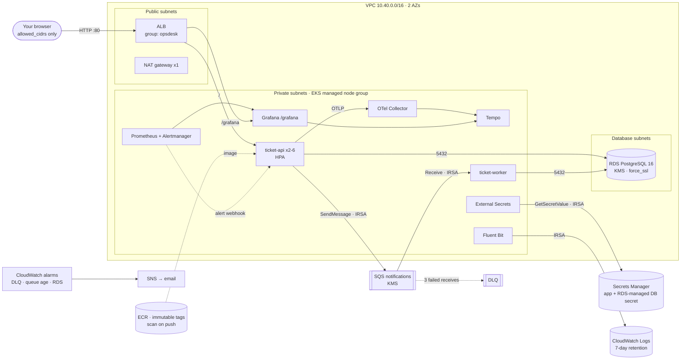

# OpsDesk on AWS — deployed by GitHub Actions

Nothing runs on your laptop. **GitHub Actions** runs Terraform, builds and scans the image, deploys to EKS,
runs the failure drills and tears everything down. It authenticates to AWS with **GitHub OIDC** (short-lived
credentials, no AWS keys stored anywhere). Everything is Terraform run by GitHub Actions; the only manual AWS step
is creating the OIDC trust and the deploy role once in the IAM console (GitHub cannot log in before they exist).



| Layer | Terraform root | What it creates |
| --- | --- | --- |
| Bootstrap (once) | `terraform/bootstrap` → `terraform/modules/github_oidc` | GitHub OIDC provider, deploy role `opsdesk-github-deploy` (trusts only this repo's `main`, PRs and the `demo` environment), S3 state bucket (versioned, encrypted, TLS-only, native S3 locking) |
| Infrastructure | `terraform/infra` → `terraform/modules/*` (network, kms, eks, ecr, sqs, rds, secrets, irsa, observability, security) | VPC (1 NAT, flow logs), EKS + managed node group, ECR, RDS PostgreSQL, SQS + DLQ, KMS key, IRSA roles, Secrets Manager, CloudWatch log groups + alarms + SNS, AWS Budget; Day-4 toggles for GuardDuty, Security Hub, Inspector, CloudTrail |
| Platform | `terraform/platform` | gp3 StorageClass, namespaces with Pod Security levels, AWS Load Balancer Controller, External Secrets Operator, metrics-server, Cluster Autoscaler, Fluent Bit → CloudWatch, kube-prometheus-stack (Grafana on the ALB at `/grafana`), Tempo, OpenTelemetry Collector, the OpsDesk dashboard |
| App | Helm (`helm/opsdesk` + `values-eks.yaml`) | ticket-api, ticket-worker, Ingress (ALB), ExternalSecret, IRSA service accounts, NetworkPolicies, ServiceMonitors, HPA, PDB |

## Cost while it runs (approximate, us-east-1 on-demand)

About **$12–14 per day**: EKS control plane ~$2.40, 3× m5.large ~$6.90, NAT ~$1.10 + data,
ALB ~$0.60, RDS db.t4g.micro ~$0.40, EBS volumes ~$0.40, public IPv4 addresses ~$0.40, small amounts for KMS,
Secrets Manager and CloudWatch. **Run the Destroy workflow whenever you stop working**; Infrastructure + Release
rebuild everything in about 40 minutes. Breakdown and savings recommendations: [cost.md](cost.md).

## One-time setup

**1. GitHub** — push the repo (`ngems1/observability-sre`). CI runs right away; the AWS workflows skip themselves
until step 3 is done.

**2. Bootstrap (once)** — GitHub cannot log in to AWS until a role trusts it, so the trust is created once by hand
in the IAM console (region **us-east-1**); everything after that is Terraform run by GitHub Actions.

*2a. OIDC provider* — IAM → **Identity providers**. If `token.actions.githubusercontent.com` is already listed
(e.g. from an earlier project), skip this. Otherwise **Add provider** → *OpenID Connect* → Provider URL
`https://token.actions.githubusercontent.com` → Audience `sts.amazonaws.com` → **Add provider**.

*2b. Deploy role* — IAM → **Roles** → **Create role** → *Web identity* → Identity provider
`token.actions.githubusercontent.com`, Audience `sts.amazonaws.com`, GitHub organization `ngems1`, GitHub repository
`observability-sre`, branch `main` → Next → permissions **AdministratorAccess** → Next → Role name
**`opsdesk-github-deploy`** → **Create role**. Then open the role:

- **Trust relationships** → *Edit trust policy* → replace everything with the policy below (put your 12-digit account
  ID, top right of the console, in place of `ACCOUNT_ID`) → *Update policy*. It also allows pull requests and the
  protected `demo` environment, which the workflows use.
- **Summary** → *Edit* → **Maximum session duration: 2 hours** → *Save* (creating EKS takes longer than 1 hour).
- Copy the role **ARN** (`arn:aws:iam::ACCOUNT_ID:role/opsdesk-github-deploy`).

```json
{
  "Version": "2012-10-17",
  "Statement": [
    {
      "Effect": "Allow",
      "Principal": { "Federated": "arn:aws:iam::ACCOUNT_ID:oidc-provider/token.actions.githubusercontent.com" },
      "Action": "sts:AssumeRoleWithWebIdentity",
      "Condition": {
        "StringEquals": { "token.actions.githubusercontent.com:aud": "sts.amazonaws.com" },
        "StringLike": {
          "token.actions.githubusercontent.com:sub": [
            "repo:ngems1/observability-sre:ref:refs/heads/main",
            "repo:ngems1/observability-sre:pull_request",
            "repo:ngems1/observability-sre:environment:demo"
          ]
        }
      }
    }
  ]
}
```

*2c. State bucket* — after step 3 below: GitHub → **Actions → Bootstrap → Run workflow** → approve. It runs
`terraform/bootstrap` (bucket `opsdesk-tfstate-<account>-us-east-1`, versioned, encrypted, TLS-only) and stores that
root's own state in the bucket, so it can be re-run safely.

The same role and provider are also written as Terraform (`terraform/modules/github_oidc`): with AWS CloudShell
available, `terraform -chdir=terraform/bootstrap apply` creates the whole bootstrap, role included, instead of 2a–2c.

**3. GitHub → repository Settings**

- *Environments* → **New environment** `demo` → *Required reviewers*: add yourself (every apply, deploy, drill and
  destroy then waits for your approval: the protected-environment requirement of the plan).
- *Secrets and variables → Actions → Variables* → add:

| Variable | Example | Purpose |
| --- | --- | --- |
| `AWS_ROLE_ARN` | `arn:aws:iam::123456789012:role/opsdesk-github-deploy` | role GitHub Actions assumes (ARN from step 2b) |
| `OWNER` | `sebastien` | `Owner` cost-allocation tag |
| `ALERT_EMAIL` | `you@example.com` | budget + CloudWatch alarm emails |
| `ALLOWED_CIDRS` | `["203.0.113.10/32"]` | who can open the app/Grafana: your public IP (https://checkip.amazonaws.com) + `/32`, JSON list |
| `CONSOLE_ADMIN_ARNS` *(optional)* | `["arn:aws:iam::123456789012:user/sebastien"]` | lets your console user see workloads in the EKS console |

  Optional secret: `SLACK_WEBHOOK_URL` (otherwise notifications are log-only). Optional Day-4 variables:
  `ENABLE_GUARDDUTY`, `ENABLE_SECURITYHUB`, `ENABLE_INSPECTOR`, `ENABLE_CLOUDTRAIL` = `true`. Optional cost variables
  ([cost.md](cost.md)): `NODE_CAPACITY_TYPE` = `SPOT`, `NODE_INSTANCE_TYPES` = `["m5.large","m5a.large","m6i.large"]`,
  `NODE_DESIRED_SIZE` = `2`.

**4. Billing → Cost allocation tags** → activate `Project`, `Env`, `Owner` after the first apply (takes up to 24 h),
and confirm the SNS subscription email AWS sends to `ALERT_EMAIL`.

## Bring it up

| Step | GitHub → Actions | Time |
| --- | --- | --- |
| 0 | **Bootstrap** → Run workflow → approve (first time only) | ~1 min (state bucket) |
| 1 | **Infrastructure** → Run workflow → `apply` → approve | ~30 min (EKS ~15, RDS ~8, platform ~10) |
| 2 | **Release** → Run workflow → approve the deploy | ~8 min (CI, build, Trivy gate, ECR push, Helm, smoke test) |
| 3 | **Ops** → `load-start` | 1 min (k6 at 5 req/s) |

The Release run summary shows the **Web UI** and **Grafana** URLs (`http://<alb>/` and `/grafana`).
Logins live in **AWS console → Secrets Manager**: `opsdesk-demo/app` (`bootstrap_users` = `name:role:api_key`
entries; paste a key on the sign-in page) and `opsdesk-demo/grafana`.

After that, every push to `main` runs CI → build → scan → (approval) → deploy → smoke test → rollback if it fails.

## Workflows

| Workflow | Trigger | What it does |
| --- | --- | --- |
| **CI** | pull requests; called by Release | pytest + ruff, Docker build, Trivy (deps + image, SARIF to the Security tab), terraform validate, Checkov (Terraform, rendered Helm), helm lint, kubeconform |
| **Bootstrap** | manual, once | Terraform `bootstrap`: the state bucket (state of the bootstrap root kept in the bucket) |
| **Infrastructure** | PR / push: plan · manual: apply | Terraform `infra` + `platform` (apply needs `demo` approval) |
| **Release** | push to `main`, manual | CI → image tagged with the commit SHA → Trivy gate → ECR → Helm `--atomic` → smoke test → automatic `helm rollback` on failure. Skips deploy when the environment is down |
| **Ops** | manual | `status`, `load-start/stop`, drills 1–4, `errors-on/off`, `rollback` — each run logs timestamps and before/after state as drill evidence |
| **Destroy** | manual (type `destroy`) | app → platform → infra, in the order that lets the ALB and VPC delete cleanly |
| **Terraform fmt** | manual | formats Terraform and commits the change |

## Failure drills (Actions → Ops)

| Drill | Inject | Recover | Evidence to capture |
| --- | --- | --- | --- |
| 1 Pod failure | `drill1-pod-kill` | automatic (Deployment + PDB) | run log, Grafana availability panel |
| 2 Latency | `drill2-seed-1m-tickets` then `drill2-explain` (Seq Scan) — or `drill2-latency-on` | `drill2-fix-index` (prints the new plan) / `drill2-latency-off` | p95 panel before/after, trace with the slow DB span, `OpsDeskDatabaseSlow` ticket (layer database; injected latency instead gives `OpsDeskApiLatencyHigh`, layer unknown → app) |
| 3 Stuck queue | `drill3-stuck-queue-on` · `drill3-poison-message` | `drill3-stuck-queue-off` | **OpsDesk incident ticket opened by `OpsDeskWorkerDown`** (~3 min) with its time to recover, queue-age alarm email, DLQ alarm, delivery-time panel |
| 4 DB connections | `drill4-pool-exhaustion-on` + `load-start` | `drill4-pool-exhaustion-off` | DB pool panel, RDS connections metric, `OpsDeskDatabaseErrors` ticket (`too_many_connections`, layer database) |
| 6 Network | `drill6-network-block-db-on` (egress NetworkPolicy drops port 5432; open DB sessions are ended) | `drill6-network-block-db-off` | `OpsDeskDependencyUnreachable` ticket with `kind=connect_timeout`, **layer network** while RDS stays healthy; Network tile red on *Where is the fault?* |
| 5 Bad deploy | push a commit that breaks `/readyz` | Release rolls back automatically | Release run log, `helm history` |

Every drill that fires an alert leaves an **ALERT** ticket in OpsDesk with the suspected layer and the time to
recover: that ticket is the incident record (assign, triage, add evidence, postmortem). For each drill, screenshot
Grafana → **OpsDesk - Where is the fault?** while it is broken: the red verdict tile should match the drill's layer.
On-call steps per alert: [runbook.md](runbook.md).

| Drill | Layer it proves |
| --- | --- |
| 1 Pod kill | Kubernetes (self-heals: no ticket, availability unchanged) |
| 3 Worker stopped · poison message | Kubernetes → Queue |
| `errors-on` | Application (SLO burn rate, no layer alert) |
| 2 Missing index | Database (slow) |
| 4 Connection limit | Database (rejects work) |
| 6 NetworkPolicy blocks 5432 | Network |

## Troubleshooting

- **Release says "Deploy skipped"** — the environment is down: run Infrastructure (`apply`) first.
- **`Not authorized to perform sts:AssumeRoleWithWebIdentity`** — the trust policy of `opsdesk-github-deploy` must name
  the repository exactly (`repo:ngems1/observability-sre:...`, case-sensitive) and include the `environment:demo` line;
  the account ID in the `Federated` ARN must be yours.
- **`The requested DurationSeconds exceeds the MaxSessionDuration`** — set the role's maximum session duration to 2 hours.
- **Bootstrap fails with `EntityAlreadyExists` on the OIDC provider** — the account already has one: re-run the
  apply with `-var create_oidc_provider=false`.
- **EKS version not supported** — set the `eks_version` default in `terraform/infra/variables.tf` to a version in
  *standard support* (extended support costs extra).
- **`terraform fmt` warning in CI** — run the *Terraform fmt* workflow; it commits the formatting.
- **ALB not created / page does not load** — `ALLOWED_CIDRS` must be a JSON list of CIDRs and include your *current*
  public IP; after changing it re-run Infrastructure (`apply`) and Release.
- **Pods `CreateContainerConfigError`** — the ExternalSecret has not synced: Ops → `status` shows the ExternalSecret state.
- **No ticket after an alert fires** — Grafana → Alerting → Alert rules shows whether it is firing; Alertmanager logs
  (`kubectl -n observability logs alertmanager-kube-prometheus-stack-alertmanager-0`) show webhook errors: 401 means
  the token in Secrets Manager (`opsdesk-demo/app` → `alert_webhook_token`) and the `alertmanager-opsdesk-webhook`
  Secret differ — re-run Infrastructure (`apply`).
- **Destroy hangs on the VPC** — an ALB or ENI is left over: delete it in EC2 → Load Balancers, then re-run Destroy.

## Fallback: AWS CloudShell

The same scripts the workflows call can run in AWS CloudShell (after the bootstrap): copy the two
`terraform.tfvars.example` files, then `bash scripts/aws/up.sh` / `down.sh`. Use one path or the other for a given environment (the identity that
creates the cluster becomes its first admin).
